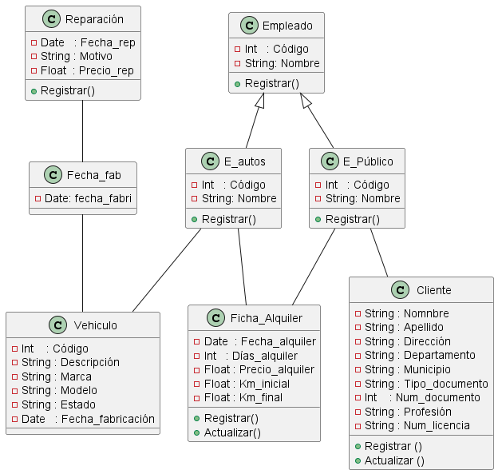

# Ejemplo diagrama de clases

## SISTEMA PARA UNA AGENCIA DE ALQUILER DE AUTOS

#### Se desea hacer un sistema para una agencia de alquiler de autos. Para determinar los requerimientos  se entrevistó al dueño de la agencia, al empleado de atención al público y al encargado de autos.

#### El dueño de la agencia que fue quien impulsó el proyecto, está especialmente interesado en tener control sobre los gastos de la empresa. Le interesa poder obtener del sistema, información del tipo en un intervalo de tiempo y todas las reparaciones realizadas por un monto superior al que el imponga.

#### `El Empleado de Atención al Público` nos contó que por cada nuevo alquiler actualiza la ficha registro del cliente. En caso de tratarse de un nuevo `cliente` abre una nueva ficha con los siguientes datos: *apellido y nombre, dirección personal, localidad, provincia, tipo y número de documento, profesión y número de licencia de conductor*.De acuerdo con las restricciones que impone el cliente busca si existe un vehículo disponible. Una vez que el cliente seleccionó un coche actualizará la ficha con el nuevo `alquiler`: *fecha del alquiler, cantidad de días por los que se alquila, importe del alquiler y kilometraje del vehículo al momento de ser alquilado.* Debe ser cuidadoso en no autorizar alquileres a clientes que no devolvieron en término o en buen estado el vehículo que se les presto.

#### `El Encargado de Autos` es el único autorizado a actualizar la ficha de registro de cada auto. Cada `vehículo` tiene su propia información: *código, descripción, marca, modelo y estado* (alquilado, disponible para alquilar o en reparación). Por cada vehículo lleva nota de todas las reparaciones que recibió. De cada `reparación` mantiene *la fecha, motivo, costo de la reparación y cantidad de días que el auto no estuvo disponible.* También atiende a los clientes que traen los vehículos. Controla que el mismo se entregue en  buen estado y en buen término, si no es así le informa al encargado de atención al público para que no autorice nuevos alquileres a ese cliente y registra en la ficha del alquiler el kilometraje final con que se devuelve el coche. 
 

#### Para elaborar el diagrama, lo primero que debemos de hacer es en indentificar todas las clases según la necesidad o problema. Por ejemplo donde econtremos una entiodad con su respectivo atributos a ese se le considera una clase.

  * Los resaltados son las clases identificadas.
  `El Empleado de Atención al Público`, `cliente`, `alquiler`, `encargado de autos`, `vehículo`, `reparación`.

  * Lo demarcado con letra cursiva son los atributos de las clases.
    
   1. *Apellido y nombre, dirección personal, localidad, provincia, tipo y número de documento, profesión y número de licencia de conductor*
   2. *Fecha del alquiler, cantidad de días por los que se alquila, importe del alquiler y kilometraje del vehículo al momento de ser alquilado.*
   3. *Código, descripción, marca, modelo y estado*
   4. *La fecha, motivo, costo de la reparación y cantidad de días que el auto no estuvo disponible.*
   
   ## Diagrama o MR
     

   ## Relaciones

   * En donde podemos ver que un empleado de atención al público atiende a muchos clientes y muchos clientes pueden ser atendidos por un empleado de atención al público.
   * Un empleado público puede realizar 1 o varias fichas de alquiler.
   * El encargado de autos puede actualizar 1 o  muchas fichas de alquiler.
   * El encargado de autos registra 1 o varios vehículos.
   * Como no se puede relacionar dos clases de muchos a muchos se crea una clase intermedia llamada fecha para relacionar las clases de vehículo y reparación, donde un vehículo puede tener una fecha de fabricación, por lo tanto en una fecha de fabricación se pueden fabricar 1 o varios vehículos.Una reparación solo tiene una fecha de reparación y en una fecha de reparación se puede se puede dar 1 o varias reparaciones.
   * Se identifica si hay herencias, por lo cual las clases  E_autos y E_Público llevan los mismos atributos por lo tanto se crea una clase "Padre" que se lleame empleado.
  