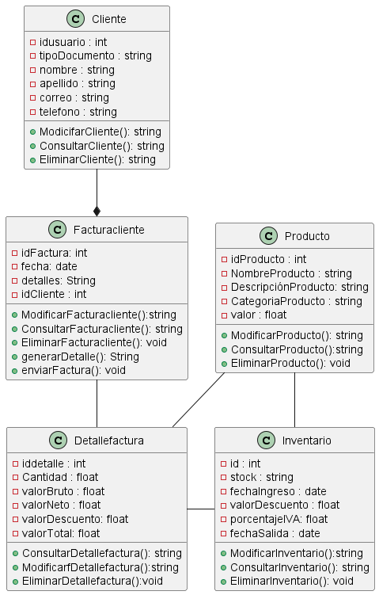

        DIAGRAMA DE CLASE DE USOS
        @startuml Diagrama de Casos de Uso
        left to right direction
        actor Cliente as C
        actor Administrador as A

        rectangle "Sistema de Facturación" {
        C --> (Consultar Productos)
        C --> (Realizar Pedido)
        C --> (Pagar Factura)
        
        A --> (Gestionar Productos)
        A --> (Gestionar Inventario)
        A --> (Gestionar Facturas)
        }
        @enduml

        DIAGRAMA DE CLASES
        @startuml Parcial 

        class Cliente {
            - idusuario : int
            - tipoDocumento : string
            - nombre : string 
            - apellido : string
            - correo : string 
            - telefono : string
            + ModicifarCliente(): string
            + ConsultarCliente(): string
            + EliminarCliente(): string
        }

        class Facturacliente{
            - idFactura: int
            - fecha: date
            - detalles: String
            - idCliente : int
            + ModificarFacturacliente():string
            + ConsultarFacturacliente(): string
            + EliminarFacturacliente(): void
            + generarDetalle(): String
            + enviarFactura(): void
        }

        class Detallefactura{
            - iddetalle : int 
            - Cantidad : float 
            - valorBruto : float
            - valorNeto : float
            - valorDescuento: float
            - valorTotal: float
            + ConsultarDetallefactura(): string
            + ModificarfDetallefactura():string
            + EliminarDetallefactura():void
        }

        class Producto{
            -idProducto : int
            - NombreProducto : string
            - DescripciónProducto: string
            - CategoriaProducto : string
            - valor : float
            + ModificarProducto(): string
            + ConsultarProducto():string
            + EliminarProducto(): void
        }

        class Inventario{
            - id : int
            - stock : string
            - fechaIngreso : date
            - valorDescuento : float
            -porcentajeIVA: float
            - fechaSalida : date
            + ModificarInventario():string
            + ConsultarInventario(): string
            + EliminarInventario(): void
        }
        Cliente --* Facturacliente
        Facturacliente -- Detallefactura
        Detallefactura-Inventario
        Producto -- Detallefactura
        Producto -- Inventario

        @enduml

        

        DIAGRAMA DE SECUENCIA
        @startuml Diagrama de Secuencias
        actor Cliente
        entity "Sistema de Facturación" as Sistema
        database "Base de Datos" as BD

        Cliente -> Sistema: Solicita Factura
        activate Sistema

        Sistema -> BD: Consulta Datos del Cliente
        activate BD
        BD -->> Sistema: Retorna Datos del Cliente
        deactivate BD

        Sistema -> BD: Consulta Productos
        activate BD
        BD -->> Sistema: Retorna Productos
        deactivate BD

        Sistema -> BD: Crea Factura
        activate BD
        BD -->> Sistema: Retorna Factura Creada
        deactivate BD

        Sistema -->> Cliente: Entrega Factura
        deactivate Sistema
        @enduml

