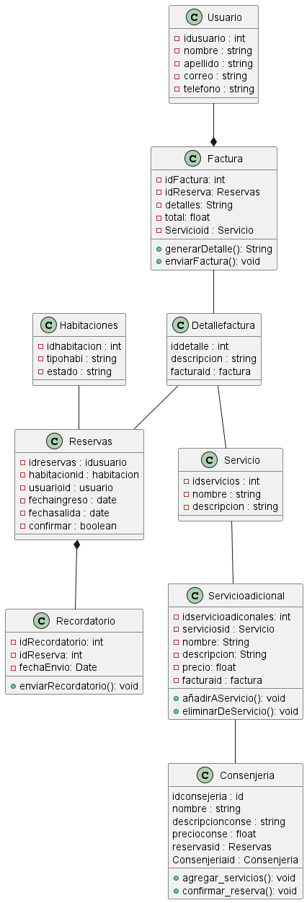
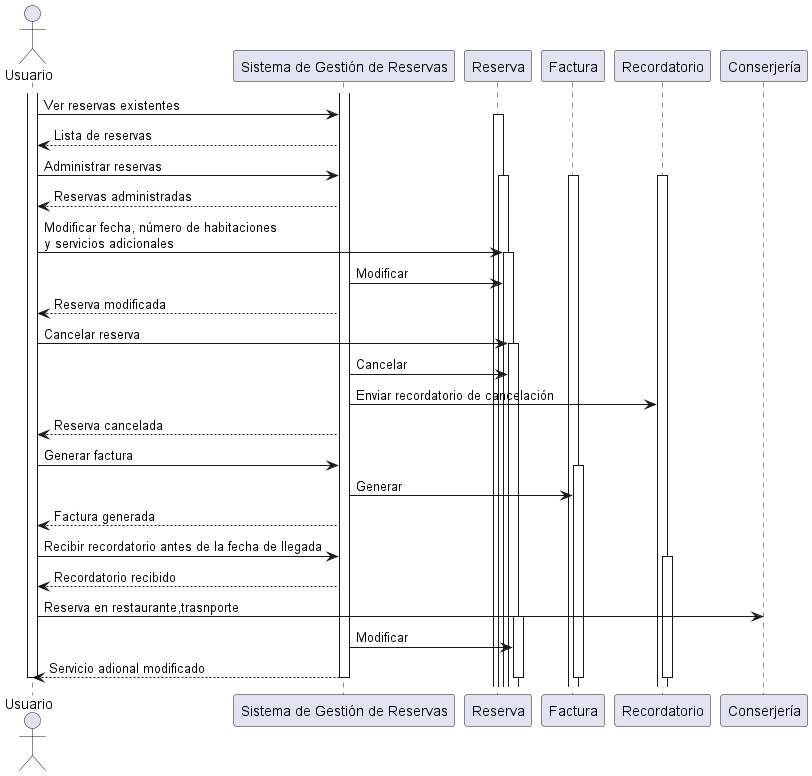
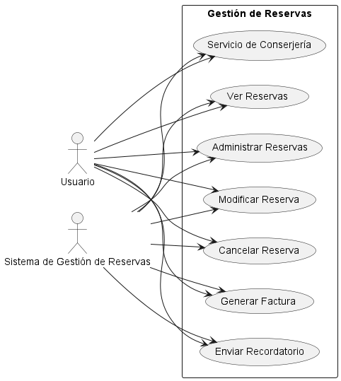

# Taller 1 - Corte 3
### Instrucciones
#### Lee detenidamente el ejercicio asignado a continuación y procede a realizar loas siguientes actividades:

1. Construye un diagrama de clases, un diagrama de secuencia y un diagrama de casos de us, según el ejercicio asignado.
2. Envía tu trabajo asignado con estricto cumplimiento del tiempo establecido.
3. Crea una carpeta en un repositorio público para cada ejercicio y proporciona el enlace junto con los archivos en la plataforma Moodle.
4. En el repositorio Git. asegúrate de previsuaizar cada uno de los diagramas y el código utilizado para crearlos.
5. Para esto último crea un archivo ;arkdown donde hagas referencia a cada uno de los diagramas construidos y su respectivo código en UMLPlant.

## Ejercicio 2 : Sistema de Reservas de Hotel
### RF1: Reserva de Habitaciones
* El sistema debe permitir a los usuarios buscar habitaciones disponibles por fechas específicas.
* Debe mostrar información detallada sobre cada habitación disponible, incluyendo tarifas, comodidades y ubicación.
* Debe permitir a los usuarios seleccionar la habitación deseada y proporcionar detalles de contacto para la reserva.
* Debe confirmar la reserva inmediatamente después de completar el proceso de recserva.
* Debe enviar una confirmación por correo electrónico al usuario con los detalles de la reserva.
  
### RF2: Gestión De Reservas
* El sistema debe permitir a los usuarios ver y administrar sus reservas existentes.
* Debe proporcionar opciones para modificar fechas de reserva, número de habitaciones y servicios adicionales.
* Debe permitir la cancelación de reservas dentro de un plazo especificado sin cargos adicionales.
* Debe enviar recordatorios automáticos antes de la fecha de llegada para confirmar la reserva.
* Debe generar facturas detalladas para cada reserva realizada.

### RF3: Servicios de conserjería
* El sistema debe ofrecer servicios de conserjería adicionales, como reservas en restaurantes o transporte local.
* Debe mostrar información actualizada sobre los servicios disponibles en la ubicación del hotel.
* Debe permitir a los usuarios solicitar servicios de conserjería como parte de su reserva o posteriormente.
* Debe confirmar las solicitudes de servicios de conserjería y proporcionar detalles adicionales si es necesario.

# Diagramas

#### DIAGRAMA DE CLASES  
 

#### DIAGRAMA DE SECUENCIA
 

#### DIAGRAMA DE CASOS DE USO
