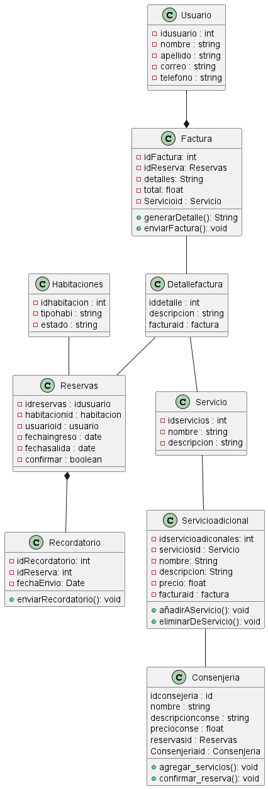

### GESTION DE RESERVAS 

#### DIAGRAMA DE CLASE

  - Este diagrama de clases ampliado incluye las clases Servicio, Factura y Recordatorio, además de los métodos y atributos adicionales en la clase Reserva para satisfacer los nuevos requerimientos.
  
  Estos son los siguientes requerimientos:

  1. Usuario: Representa los usuarios del sistema. Cada usuario tiene un nombre y un identificador único. Los usuarios pueden ver y administrar sus reservas existentes.
  2. Reserva: Modela una reserva dentro del sistema. Contiene información como el identificador de reserva, fechas de inicio y fin, número de habitaciones reservadas, servicios adicionales y una referencia a la factura generada para la reserva. También incluye métodos para modificar fechas de reserva, número de habitaciones y servicios adicionales, así como para cancelar la reserva dentro de un plazo especificado.
  3. Servicio: Representa los servicios adicionales que se pueden agregar a una reserva. Cada servicio tiene un nombre y un costo asociado.
  4. Factura: Contiene información detallada de la factura generada para una reserva, incluido un identificador único y un detalle de la factura.
  5. Recordatorio: Modela los recordatorios automáticos enviados antes de la fecha de llegada para confirmar la reserva. Contiene la fecha de envío del recordatorio y su contenido.

  >Ver
 

 ##### DIAGRAMA DE SECUENCIA

 - Este diagrama de secuencia UML muestra la interacción entre el actor Usuario y el sistema de gestión de reservas (Sistema). Se describe cómo el usuario interactúa con el sistema para ver, administrar, modificar, cancelar reservas, generar facturas y recibir recordatorios. Cada interacción se muestra como un mensaje entre los participantes, y se activan y desactivan los participantes según sea necesario para representar el flujo de interacción.
 
 Estos son los requerimientos:

 1. Usuario: Es el actor principal que interactúa con el sistema de gestión de reservas.
 2. Sistema de Gestión de Reservas: Representa el sistema que permite a los usuarios gestionar sus reservas y proporciona las funcionalidades requeridas.
 3. Reserva: Representa una reserva específica en el sistema, con la capacidad de modificar, cancelar y generar recordatorios.
 4. Factura: Representa el proceso de generación de una factura detallada para una reserva.
 5. Recordatorio: Representa el proceso de envío de un recordatorio antes de la fecha de llegada para confirmar la reserva.

 Las interacciones se describen de la siguiente manera:
 
 * El usuario interactúa con el sistema para ver sus reservas existentes y administrarlas.
 * Puede modificar una reserva existente, lo que implica ajustar la fecha, el número de habitaciones y los servicios adicionales asociados.
 * También puede cancelar una reserva dentro de un plazo especificado.
 * El sistema puede generar una factura detallada para una reserva específica.
 * Además, el sistema envía automáticamente un recordatorio antes de la fecha de llegada para confirmar la reserva.

 

 ##### DIAGRAMA DE CASOS DE USO

 - Este diagrama de casos de uso UML proporciona una visión general de las interacciones entre el usuario y el sistema de gestión de reservas, así como los distintos casos de uso disponibles en el sistema.

 * Usuario (User): Actor principal que interactúa con el sistema de gestión de reservas.
 * Sistema de Gestión de Reservas (System): Representa el sistema que permite a los usuarios gestionar sus reservas y proporciona las funcionalidades requeridas.
 
 - Casos de uso:
  
   1. Ver Reservas: Permite al usuario ver sus reservas existentes.
   2. Administrar Reservas: Permite al usuario administrar sus reservas existentes, lo que incluye la modificación, cancelación y generación de facturas.
   3. Modificar Reserva: Permite al usuario modificar una reserva existente, incluyendo ajustar fechas, número de habitaciones y servicios adicionales.
   4. Cancelar Reserva: Permite al usuario cancelar una reserva existente dentro de un plazo especificado.
   5. Generar Factura: Permite al usuario generar una factura detallada para una reserva específica.
   6. Enviar Recordatorio: Permite al sistema enviar automáticamente un recordatorio antes de la fecha de llegada para confirmar la reserva.

   